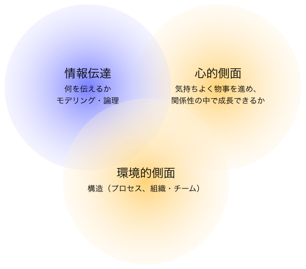

# The Communication of Communications
**コミュニケーションを円滑にしプロジェクトを成功に導くためのパターン**

- 本橋 正成[^moto]
- 林 栄一[^hayashi]

[^moto]: MOTOHASHI, Masanari, [東京工業大学](http://www.titech.ac.jp) / [Agile Communication Program](https://www.facebook.com/AgileCommunicationProgram)

[^hayashi]: HAYASHI, Eiichi, [セントラルソフト(株)](http://www.central-soft.co.jp) / [Agile Communication Program](https://www.facebook.com/AgileCommunicationProgram)

# Abstract
プロジェクトや仕事場では、様々な問題が発生しているが、その原因としてコミュニケーションの問題にフォーカスされることが多い。
コミュニケーション能力が必要とされているにもかかわらず、そのノウハウを知らず、十分に適用されているとは言えない。
コミュニケーションに問題が発生すると、情報伝達に問題が起こりがちだからだ。
本論文では、プロジェクトや仕事場におけるコミュニケーションの問題を明確にし、コミュニケーションの前提や心がけ、チームビルディングなど、プロジェクトや仕事場などの現場で円滑に進めるためのノウハウを解決策として、パターン形式を用いて提案する。

# はじめに
プロジェクトや仕事場では、複数の人が関わり組織として推進することが一般的だ。
アジャイル開発などの方法論[^agile]、SNSやスマートフォンなどコミュニケーションツールの開発により、よりコミュニケーションが必要になっている。
たとえば、プロジェクトの成功要因は、顧客の巻き込みや経営陣との調整など、コミュニケーションに関するものが占めている[^CHAOS2012]。
新入社員に求められる技術も、コミュニケーション能力が必要とされている[^rjc2009]。

[^agile]: [Manifesto for Agile Software Development](http://agilemanifesto.org)

[^CHAOS2012]: the Standish Group, 2012, IT Success and Failure -  CHAOS Report Success Factors

[^rjc2009]: 株式会社RJCリサーチ, 2009, 仕事についての調査結果 - RJC Report 2009

プロジェクト成功や継続的な利益を享受するために、軽やかで健康的なコミュニケーションが必要だ。コミュニケーションをスムースにする必要がある。

しかしながら、プロジェクトや環境におけるコミュニケーションの技術についての＜コトバ＞がないため、コミュニケーションについての本質的な問題が解決されていない。

プロジェクト成功や継続的な利益を享受するために、軽やかで健康なコミュニケーションが必要であるので、プロジェクトや仕事場におけるコミュニケーションの問題を明確にし、その解決策をパターン形式を用いて提案する。

# 方針


コミュニケーションの要素は、「1.情報伝達」 「2.心的側面」 「3. 環境的側面」の三つがある。
「1.情報伝達」は、様々なモデリング[^uml2005]や論理などの方法が適用されてきた。
本論文では、「2.心的側面」を中心に捉え、この「2.心的側面」と「3. 環境的側面」をスコープとする。

[^uml2005]: マーティンファウラー, 2005, UML モデリングのエッセンス 第3版 (Object Oriented SELECTION)

# 方法
本研究の方法を学習し、プロジェクトや仕事場に適用するために[Agile Communication Program](https://www.facebook.com/AgileCommunicationProgram)を設立した。

コミュニケーション技術を安全にしかも確実に運用するため、方法を学び、認定資格を取得しただけでなく、プロジェクトや仕事場へ適用するために、アジャイル開発系のイベントである[Sukusuku-scrum](http://sukusuku-scrum.doorkeeper.jp/events/9549), [Agile Japan 2014](http://www.agilejapan.org/2014/program.html#koubod-4), [XP祭り2014](http://xpjug.com/xp2014-session-h4/), [アジャイルサムライ横浜道場](http://yokohama-dojo.doorkeeper.jp/events/15387)などでワークショップを行い、そのフィードバックを得ながら、確実なものとした。

# パターンリスト
- コミュニケーションの前提
- 環境と自己のシステム
- あえてコミュケーションにフォーカス
- 小さな石（やるのは自分だ）
- 知識の砂場（サンドボックス） [^motoblog1]
- 謙虚な自信 [^motoblog2]
- 伝わる意見：レビューやコメントなどフィードバックの仕方[^motoblog3]
- 種を探す牛：フィードバックの受け方[^motoblog4]

[^motoblog1]: 初出：[チームの育て方(1) ：新しい知識の砂場（サンドボックス） - ari's world](http://motohasi.hatenablog.com/entry/2014/06/04/135350)

[^motoblog2]: 初出：[チームの育て方 (3)：プライドと自信 - ari's world](http://motohasi.hatenablog.com/entry/2014/06/06/020242)

[^motoblog3]: 初出：[チームの育て方(2)：アウトプットの育て方（レビューやコメントなどフィードバックする方法） - ari's world](http://motohasi.hatenablog.com/entry/2014/06/05/090006)

[^motoblog4]: 初出：[チームの育て方(4)：フィードバックの受け方 - ari's world](http://motohasi.hatenablog.com/entry/2014/06/11/190426)

---

# コミュニケーションの前提

- 「今、時代は、リーンだよ、アジャイルやれば、コミュニケーションが改善するんだよ」
- 「NVC (Non Violent Communication)って知っている？これやれば、いいんだよ」

果たして、問題は改善したのだろうか。

## 状況
アジャイル開発などフィードバックを得つつ、ダイナミックにプロジェクトや仕事を進める方法が一般的になってきた。

## 問題
プロジェクトや現場でのQCDが悪化し、大きな問題になっている原因として、コミュニケーションの問題が挙げられる。
たとえば、Agile Japan 2014の参加者に *コミュニケーションの問題によってプロジェクトに悪影響が出たことの経験*について、挙手にて確認したところ、ほぼ全員が該当している。

しかしながら、書籍や技術が紹介されているコミュニケーションの技術を適用しても、コミュニケーションが解決せず、プロジェクトや仕事場の状況が悪化することさえある。

## フォース
- コミュニケーションの問題を理解し、問題を解決する糸口がわからない。ときには精神論になり具体的なアプローチが困難になっている。
- アジャイル開発のScrumのプロダクトオーナーとチームを分けることによって、構造的な対立を生み出しコミュニケーションが悪化しすることがある。
- アサーティブや傾聴、NVC(Non-Violent Communication)などの技術を使ったとしても、コミュニケーションが良くなるとは限らない。さらには、方法論に着目するがゆえに、相手への配慮が欠け、むしろ関係性が悪化する場合さえある。

## 解決策
**コミュニケーションの根底に、他の人についての考え方や付き合い方の「構え」が大切になってくる。**

Team Geek[^teamgeek]では、これを<u>HRTの原則</u>と呼ぶ。HRTは、ハート(Heart)と発音する。

[^teamgeek]: Brian W. Fitzpatrick、Ben Collins-Sussman, Team Geek――Googleのギークたちはいかにしてチームを作るのか, 2013

> あらゆる人間関係の衝突は、謙虚・尊敬・信頼の欠如によるものだ。

- 謙虚(Humility)
	世界の中心は君ではない。君は全知全能ではないし、絶対に正しいわけでもない。常に自分を改善していこう。
- 尊敬(Respect)
	一緒に働く人のことを心から思いやろう。相手を1人の人間として扱い、その能力や功績を高く評価しよう。
- 信頼(Trust)
	自分以外の人は有能であり、正しいことをすると信じよう。そうすれば、仕事を任せることができる。

今も昔も世界の組織で共通している関心事として、エイブワグナー氏は、以下のことを紹介している。

- 尊重の念を持って公平に接してもらいたいと考えている。
- 自尊の気持ちや同僚を尊敬する気持ちを率直に表現できず、他者との交流に悩んでいる。
- 人の多様性を活かして組織が機能してほしい。
- 尊重によって職場の誰しもが成長しやすくなるようになっていてほしい。
- 自分や他者が良い心の状態に変化し、促進する方法を知りたい。

このような謙虚・尊敬・信頼の構えを持つことが、コミュニケーションを取る時の基本的な構えとなる。
このような前提がないときは、健全で効率的なコミュニケーションが困難になる。

HRTのある関係性を築くためには、まず自らがHRTの構えを維持できるよう心掛ける。
もし双方向にHRTを前提とした関係性を築けないときは、ハラスメントの可能性があるため学習が停止してしまう[^yasutomi]。
コミュニケーションを改善させる方法を選択する。

[^yasutomi]: 安冨 歩, 本條 晴一郎, 2007 ハラスメントは連鎖する 「しつけ」「教育」という呪縛 (光文社新書) 

<!--## 関連するパターン
- 値引きすると価格競争になってしまうパターン（予定）
- 値引きと貯蓄パターン（予定）-->

---

# 環境と自己のシステム

 「（ふりかえりにて、反省点として）コミュニケーションが取れていなかったのが、問題の発端でした。」 
しかし、そのコミュニケーションという言葉が思考停止ワードとなり、その問題は解決しなかった。

## 状況
人は、社会的な動物である。たとえば、自分を犠牲にしてでも困った人を助けることが評価されることは、社会性を大切にしていることを示している。

プロジェクトや仕事場では、成果を出すために複数の人が関わって実施することが一般的になってきた。

## 問題
複数の人が関わると、やり取りされる情報の量と質が増え、コミュニケーションの割合が高くなるにつれ、コミュニケーションへの質的向上への要請が高まった。

プロジェクトの失敗について*ふりかえり*を行ったとしても、コミュニケーションが問題にあがることが多い。
しかしながら、コミュニケーションの状況をよくするためにどのような観点があるのかがよくわからず、「報・連・相（ほうれんそう、報告、連絡、相談のこと）」を徹底しよう、ドキュメントにすべて記述しよう、などのような解決策が取られるが、プロジェクトや仕事場で成果に結びつかない。

このように、コミュニケーションは、もやっとしていて、とらえどころがないように感じる。

## フォース

- コミュニケーション能力が大切と言われながら、言葉を持っておらず、単なる根性論になってしまう。
- 問題に対して報告や相談をしたが、具体的な方法は示されない。
- 自ら創意工夫しようとすると、命令に従うように反論する。
- その場でのコミュニケーションを円滑にするスキルを身につけても、本質的な関係性は改善しない。

コミュニケーションの質的な向上は困難であることが多く、どのような側面があるのかを明らかにしたい。

## 解決策
**コミュニケーションについて一般的な構造を明確にし、そのそれぞれについてアプローチする。**
コミュニケーションには、環境的側面と自己的側面のふたつがある。環境的要因には、物理環境と論理環境がある。自己的側面は、たくさんの属性があるが、ここでは自我状態を紹介する。

コミュニケーションのモデルを示す。

環境要因は、物理環境・論理構造（組織構造やプロセス）などの構造の上に、慣習や規範がある。たとえば、「日次ミーティング」や「チーム全体がひとつに」などのアジャイルプラクティス[^IPAagile]は環境を改善する。

[^IPAagile]: 「アジャイル型開発におけるプラクティス活用事例調査」の報告書とリファレンスガイドを公開：IPA 独立行政法人 情報処理推進機構 http://www.ipa.go.jp/sec/softwareengineering/reports/20130319.html

自己的側面の典型的なモデルの例としては「自我状態」がある。自我状態とは、*人が表出している全ての刺激情報、人格の構成要素のこと」人間の行動を理解する手助けになる*。健康的で効果的な状態と、非効果的な状態がある[^bcb]。

[^bcb]: 交流分析を参考にしている Abe Worgner "Breaking the Communication Barrier" による定義。

**片方だけを改善しても、大きな成果を得られないため、これらの環境的側面と自己的側面の双方からのアプローチが有用だ。**

環境的側面について、質・量を増やし、なめらかに効率的にする。
たとえば、アジャイルプラクティスや、組織パターン[^cope]の適用は、大きな手助けになる。

[^cope]: James O. Coplien, Neil B.Harrison, 2004, Organizational Patterns of Agile Software Development

自我状態は、非効果的な状態から効果的で健康な状態にする。
そのため、1. 自我状態を観察する、2. 効果的かどうかを判断する。 3. 効果的ではないときは、改善策を検討し適用する、などを行う。

もし、あなたがマネージャなど管理する状況であれば、環境要因から改善することが効率的であり、あなたがメンバーであれば自我状態から改善することが妥当になる。

この環境的側面と自己的側面からのアプローチは、コミュニケーションにおける十分条件ではなく、必要条件である。

## 結果
### 利点
環境要因と自己要因の二つの双方向の視点から改善することによって、無理なくコミュニケーションの状態を継続的に改善していく。

### 負債
コミュニケーション環境が改善すると、集中して考えたり、作業したりする時間がなくなる。その結果、プロダクトなどの成果物の質が悪化する可能性がある。そのため、コミュニケーションだけでなく、他の要因とのバランスを考えるようにする。

---

# あえてコミュケーションにフォーカス
<<<<<<< HEAD
=======

- 「コミュニケーションの問題があるから、ほうれんそう（報告・連絡・相談）をしっかりな。なんでも言ってくれ。」
- 「（数日後に相談しに行ったところ）そんなこともわからないのか、自分で考えろ。」

>>>>>>> FETCH_HEAD
## 文脈
複数の人が仕事している中で、様々な問題が発生する。
たとえば、プロジェクトであれば、要件や仕様が頻繁に変わり、リソースが足りず、QCDを満たせない、などの問題がある。
それらの問題を悪化させる要因として、コミュニケーションの問題があげられる。

例えば、定常的に発生する仕様を策定するメンバーから、実装者へうまく仕様が伝わらないという問題を解決するために、QAシステムを導入するなど過度にツールに頼る場合がある。
それで実務上は解決する場合もあるが、仕様策定者と実装者との軋轢の問題や仕様策定者が攻撃的で実装者が萎縮しているなど、もっとも本質的な問題である可能性はみすごされやすく、今後のリスクになる。

## 問題
コミュニケーションの問題は、リスク事項である。
非効果的な自我状態から発生した問題を技術で解決しようとするので、作業が増えるなど、本来の解決に至らず、リスクとコストが増大するだけである。
そのため、心理的な問題を解消する必要がある。
この場合は、平常心で目が開いていれば、発生しない問題である。

しかしながら、コミュニケーションや心理的な問題について話題にすると、上から目線に取られがちなど、センシティブでナイーブな関心事である。
そのため、触れられることが少なく、課題管理表に載せられない。
また、触れたとしても心理的な問題については、新たな問題を発生しがちである。

> “われわれの抱える主要な問題は、
そもそも技術的ではなく社会学的なものである” 
Peopleware – Tom DeMarco

**多くのプロジェクトや現場において、コミュニケーションや心理的な問題と解決策についての言葉を持っていないので、扱うのが難しい状態になっている。**

## 解決策
コミュニケーションや心理的な問題が発生する前に、自分の心理状態を客観的に自己診断しておき、健全な心理状態を維持することで大きな問題に発展することを予防することができる。

1. パターンとして共有しておき、問題が発生する前に健康的に話すことが必要。
2. 非効果的な状態の自己チェックリストが必要

また、関係者の心理状態も健康的な状態に持っていく必要がある。

1. 隔離された安全な場所で議論をする。
2. 効果的な心理状態で当事者がお互いに話せるようにする。
3. 取り組むべき問題の一つとして、心理状態が非効果的な状態に陥ること無く話せるようにする。

### 自己チェックリスト

なにかがうまくいっていないときに、外からのチェックでは不十分であるので、自分でチェックできるようにする。
以下は、そのためのチェックリストの例である。

1. 非効果的な状態になっているときは、自分のことを考えにくい状態だ（メタ認知しにくい状態）。冷静になってふりかえる機会を設ける。
2. 自分の感情がどのような状態だったか判断する。特に、怒り、ねたみ、悲しみ、恐怖などに気がつく。
3. 自分の感情を引き起こした事象や現象を探す。
4. 感情と事象の間に、認知の歪みがあるかどうか、検討する[^Burns2004]。
5. その感情を認め、その感情を流す。

どういう状態かメタ認知することで、大きな失敗を防ぎ、相互依存の連鎖を食い止めやすくなる。

[^Burns2004]: デビッド・D.バーンズ, 2004, 『増補改訂 第2版〉いやな気分よ、さようなら―自分で学ぶ「抑うつ」克服法』

### 相手を巻き込むプロセス

一人だけで効果的な状態になっても、根本的な解決にはいたらない。関係性の問題で、相手を巻き込む必要がある。

1. 相手が、どのような感情であったかを考える。
2. その感情を引き起こした事象を考える。
3. あくまで、青の状態を保ったまま、どのように関わるかを考える。

具体的なパターンについては、別パターンを参照してほしい。

### 第三者からのアプローチ
1. 第三者が、当事者に個別の問題について、アプローチするか（本人達は、その問題に気がつかない）
	- 当事者が、抽象化する時間やタイミングがないときに使う。
2. 第三者が、当事者に問題そのものを伝え、当事者同士で解決するようにアプローチする。
	- 永続的・長期的な効果が見込まれる。

両方ともに、信頼関係が前提になる。

## 結果
技術的な観点だけではなく、コミュニケーションの問題を視野に入れ、本質的な問題解決を目指す。

しかしながら、ふりかえり(レトリスペクティブ)などで「コミュニケーションの問題」が思考停止ワードになっているときがある。
思考停止になってしまったときは、あえて「コミュニケーション」という言葉を禁止ワードにし、コミュニケーションにおける本質的な問題をさぐるなどの取り組みがある。

また、コミュニケーションの問題を挙げた人が「<u>小さな石（やるのは自分だ）</u>」パターンに当てはまっているかを確認すると良い。

---

# 小さな石（やるのは自分だ）

- 「（特定の人を名指しして）あいつのコミュニケーション能力がないから、いけないんだ。まったく…」
- 「主体性がなく、自己組織化に向かないやつは去れ！」

## 状況
様々なプロジェクトや仕事をしているときに、自分ではメンバーを選ぶことができない。
メンバーを代えることは現実的に難しいにもかかわらず、成果を出す必要がある。
たとえば、自己組織化などのチーム開発のプラクティスを好まない人もいる。

## 問題

どんな大人でも、期待する分野で必ずしも精神的に成熟しているとは限らない。たとえば、自己組織化などのチーム開発に向かない人もいる。

関係する人たちの多様性を尊重し人間として成長できるようにしなければならない。

社会の仕組みが回りだすと、あたかも自分でコントールすることができないようになる。

そのような状態で結果を出すことが困難であると、関係する個人それぞれの主体が、個人としてはこの状況に対して自分一人の力では環境に影響を与えられないと考え、自分よりも影響力のある誰かがやるだろう、あるいはやるべきと考えやすい。

結果として、だれも行動を起こさないために、環境の変化は起こらず、適切ではない状況から脱するか、あるいは、そのような状況であっても期待できるような成果を作るようなイノベーションが発生せずに、停滞感をともなった感覚に支配される。

## フォース

- アジャイル開発や標準など、決まったなんらかの方法を適用することが必ずしも最適解ではない。
- 精神的に大人でない人がいても、 物事がうまく行くようにしなければならない。
- 自己組織化に向かない人がいても、多様性を活かした組織運営をしなければならない。
- 技術に未熟なメンバーや逆に技術に長けたメンバーの両方がいてもそれぞれの特性を活かされておらず、お互いが孤立している。
- 特定の得意なスキルを持つメンバーの力が活かされておらず、無力感を感じている。
- これらの問題について管理者がきづいていないか、問題としていない。

## 解決策

コミュニケーションの問題に気がついている「あなた」が行動を起こすことが必要。小さな石でも、波紋は大きく広がる可能性がある。

どんな手法であろうと、手法の妖怪に乗っ取られないように
まず当事者としてのあなたの意思が必要である。

そのためには、どのように説得するか戦略を立てる。

1. 感情的にならず、事実を集める。
2. 事実ベースで議論する。
3. 自分の思いを率直に言う

どんなところでも、自分でできる「小さな石」を探しましょう。
それは大きな波紋になるかもしれません。

---

# 知識の砂場（サンドボックス）
## 知識を新しく導入する際の問題点

新しい技術や方法論などの知識を、関わっているプロジェクトや業務に導入することは、様々なメリットがあることが多い。
しかしながら、チームで作業している際、その知識を導入することによって、問題が発生することがある。

1.  **そぐわない知識による問題発生**

	適用しているプロジェクトの状況とは、特性が合致しない。
	たとえば、既存のビジネスを分析するためにふさわしいツールを、企画段階の初期に投入しようとするため、具体的な企画ができない。
	状況にそぐわない方法論や技術などの知識を導入しても、問題が解決しないだけでなく、あらたな問題を生み出すことがある。

2. **導入コストの発生**

	新しい技術や方法論の導入には、学習のための時間などの工数を要する。
	そのための習得している間は、パフォーマンスが一時的に下がる。

3. **乏しい経験によるムダの発生**

	新しい知識は、そもそも経験が少なく、勘所や回避方法などがない。
	そのような知識をプロジェクトに導入しようとしても、プロジェクトそのものが進まなくなり、失敗してしまう。

### もしかして：アーリーアダプターとプロジェクト
社会学者エベレット・M・ロジャーズの『イノベーション普及学』で、イノベーションがどのように組織に普及するかを明らかにした。
ロジャーズによると（以下、[情報マネジメント用語辞典：アーリーアダプター（あーりーあだぷたー） - ITmedia エンタープライズ](http://www.itmedia.co.jp/im/articles/0502/24/news129.html)より）イノベーションの普及は、

> 1. 冒険的で、最初にイノベーションを採用するイノベータ（革新的採用者）
> 2. 自ら情報を集め、判断を行う。マジョリティから尊敬を受けるアーリー・アダプター（初期採用者）
> 3. 比較的慎重で、初期採用者に相談するなどして追随的な採用活動を行うアーリー・マジョリティ(初期多数採用者)
> 4. 疑り深く、世の中の普及状況を見て模倣的に採用するレイト・マジョリティ（後期多数採用者）
> 5. 最も保守的・伝統的で、最後に採用するラガード（採用遅滞者）

のように整理されている。

アーリー・アダプターを目指し、マジョリティから尊敬を受けること目的としている人は、その知識が採用されていないプロジェクトと衝突が発生する場合が多い。 さらに、何らかの方法論の導入が目的化しやすく、有効な成果を生み出すことが困難になっている（**目的の手段化**）。

つまり、<u>現場やプロジェクトを視点</u>では、その方法論や技術などの知識は役に立たず、イノベーションではなく単なるコストやムダになってしまうことがある。

### もしかして：自己顕示欲のための知恵
プロジェクトの企画段階において、社会的な関心や問題に話題が移ったとしても、「それは××だ」とか「おれ、知っていた」と自分物語を熱心に話し、会議が横道にそれてしまいがちなメンバーがいる。

「自分のためではなく、チームで…」とお願いしても、否定される。なぜなら、そのメンバーの自己顕示欲が満たせなると考えれば、その人に取ってみれば回避すべきことになるのだろう。

また、メンバーに対する批判や見下しを伴うと、その知識がどれだけ有用であったとしてもチームメンバーのモチベーションが低下し、成果物への関心が薄れてしまいがちだ。

その人の自己顕示欲を満たされないと、その人への対応に追われ、チームの進捗を悪化させることになってしまう。

**その結果、新しい技術や方法論などの知恵を導入することが手段の目的化し、プロジェクトが遅延し、場合によっては消滅する。**

## フォース：解決しようとしたけれど
どんなに優れた方法論であったとしても、状況にあっていなければ、役に立たないどころか有害でさえある、ということだ。
新しい方法論や技術の導入には、コストがかかることを認めないと、プロジェクトの遅延や失敗に結びついてしまう。

手段の目的化のため、プロジェクトが進んでいかないため、この問題を回避するためには、いくつかの対策がある。

- *議論や質問＞平行線（お花畑）*

	ある技術や方法論などの知識が正しく、正義であると考えていると、あらゆる問題が解決できるように信じてしまう。
	たとえ、その知識にどのような効果があるか、なぜ、それを採用しなければならないのか、どれだけの工数が必要になるか質問しても、書籍で紹介されている良いところしか見えていない人を説得するのは難しい。
	たとえば、論理的に説明したとしても、その知識を信じている人の自尊心が満たされない、というクレームを付けられるなど健全な議論が成り立たない。

- *タイムボックス＞侵略されるタイムボックス*

	時間を区切り、その中で議論や作業を進めるタイムボックスという手法がある。
	タイムボックスを決めたとしても、次のタイムボックスも、その議論が大切だ、という説得になるため、その手法の大切さを議論する。もしくは、タイムボックスを決めるための議論が終わらず、タイムボックスが成立しなくなってしまう。
	

このような調査のための工数が無視できなくなり、適切な運用ができず、プロジェクトも頓挫している。
いっこうに問題は改善しない。

## 解決策

**それゆえ、プロジェクトは、成果を出すことに集中し続け、新しい知識は、勉強会や実験プロジェクトなど領域を区切り、その中で存分に試そう。**

1. **プロジェクトは本試合**

	プロジェクトは、アウトプットを出すことに集中する。
	アウトプットを出すことを主たる目的とし、その主たる目的をサポートするための知識と位置づける。
	何らかのアウトプットを出すことは、それなりに時間や費用がかかるため、アウトプットを出すことを守る。
	試合を楽しもう。

2. **サンドボックスの用意**

	新しい知識を学習し、導入するときは、時間を作り、プロジェクトのスコープを減らすなどの調整を行った上で、試験的に運用する。
	その経験を伴わない知識は、昇華され、信頼に値するものになる。
	サンドボックスとは、安心して試すことができる場所や時間のことを示す。
	実験し試すためのサンドボックスを作り、存分に遊ぼう。

3. **サンドボックスで試す：建設的な懐疑心**

	自分の持っている成功体験や知識について、絶対的に正しいと思うのではなく、常に良い意味での懐疑的な態度を持とう。
	もし正しいと信じた時点で、他の適切な情報がシャットアウトされ、成長が疎外されることが多い。
	また、自分の知識が絶対的に正しいと考えた時点で、建設的な議論が困難になりがちだ。
	サンドボックスで、知識を叩き上げよう。

4. **サンドボックスから本試合へ**

	状況を見極めて、プロジェクトや業務に改めて、その知識を導入する。
	そのときには、すでに叩き上げられた確固たる知識になっているので、安心して適用できる。
	むろん状況に合わなければ、その知識を導入することは見合わせ、虎視眈々とチャンスをうかがおう。

## 結果
そのプロジェクトが解こうとしている問題に着目し、成果を出すことに集中することによって、副次的に経験を伴った独自の知識を得られた。

一方で、クローズドな環境を用意し、その知識を徹底的に試し、叩き上げることで、より強固な知識に得ることができた。

ただし、その自己顕示欲が強いメンバーにとってみれば、限定されることがおもしろくなく、より不満が大きくなっている。しかしながら、プロジェクトのスループットが上がり、少しながらアウトプットが出せるようになってきた。
アウトプットに応じて、品質も向上するなどのチームとして成長するようになってきた。

## 組織はバランスをとる、ということ。

根本的には&quot;軽く見られてしまうと劣等感&quot;や自己顕示欲が、根本的な問題なのかもしれない[^wada]。
劣等感を解消するために、相手より高い位置を確保する<u>自己顕示欲</u>が強く働くため、周りの人の足を引っ張ったり、もしくは、自分の信念を押し付けるなどによって、相対的に自分の支配ができるように働きかける。
その結果、チームや組織として、バランスが崩壊することになる。

[^wada]: [退職のときに元上司が僕に言った慧眼のコメント | 和田一郎](http://www.huffingtonpost.jp/ichiro-wada/resignation_b_6051744.html)

> なにかの本で学んだことや、シンプル過ぎるものにすべて委ねて信念としてしまうと、時として、ただの「頑固」になってしまう。

むろん、シンプルで分かりやすいものは理解しやすく、伝わりやすい。
しかしながら、それを信念としてしまうと、状況が見えず、極めて危険な状況になりやすい。
むろん、その「信念」が有用かもしれないため、サンドボックスを作り、その中で試すことを提案した。

---

# 謙虚な自信

チームで仕事をしているとき、殺伐とし崩壊することがある。
逆に、タフな状況ながら、一体感を感じ、成果を出しやすいチームもある。
一体、何が違うのであろうか。

複数のメンバーからなるチームをどうやって育てるのか、チームと一緒に自分が育つのかを考えてみたい。

## 問題：疲弊させるアクション

チームを壊すアクションとしては、どのようなものがあるのだろうか。
たとえば、こんなことは、チームを疲弊させる：

1. *メンバーをうらやましがり、足を引っ張る*

	あるメンバーがよりよい状態にいるとき、うらやましがる。
	そのメンバーのアウトプットについてレビューやフィードバックでは、徹底的に批判し、否定し続ける。
	また、そのメンバーの友人や知人に対し、ネガティブな印象を流す。
	その結果、相対的に自分の評価があがる。
	
	*ただし、他人の批判を繰り返すことは、自分自身の評価も巻き込まれることになる。*

2. *主体的に動く人を、徹底的に否定する*

	メンバーがリーダーシップを発揮している人は、自分の影響力が弱まるため、その活動や提案には「興味がない」「関係ない」「まったくなっていない」など否定的なコメントを返し、さっぱり会話を終了させる。
	さらに、そのメンバーの能力不足を厳しく指摘することも忘れてはならない。
	強力なのは、自分の欠点をメンバーの欠点として責め立てると、相手は反論しにくくなる。
	その結果、主体的に動く人は距離を置くようになる。
	
	*ただし、自分に関係のないところで活動が行われることになる。*

3. *自分の成果や立場を極めて大切にする*

	チームで聞いた参考になる話しや成果は、許可を得ず、自分のこととしてTwitterなどのSNSに公開する。
	また、自分の目的実現や評価向上のために、チームでの取り組みを、あくまで自分の取り組みとする。
	
	自分の立場を保身もしくは上げるためにチーム内の政治に力点を置くと、メンバーは安心してチームに貢献し、進めることが困難になる。
	
	*ただし、メンバーはチームへの情報公開や議論を躊躇し、距離を置くようになる。*

**このように、自分のプライドや立場（エゴ）を大切にすると、チームは疲弊し、健全なコミュニケーションが成り立ちにくくなる。**

## 疲弊する理由

[Team Geek ―Googleのギークたちはいかにしてチームを作るのか](http://www.amazon.co.jp/gp/product/4873116309/ref=as_li_ss_tl?ie=UTF8&camp=247&creative=7399&creativeASIN=4873116309&linkCode=as2&tag=ariscribbling-22)には、このように紹介されていた。

> あらゆる人間関係の衝突は、謙虚・尊敬・信頼の欠如によるものだ。

経験的に、人間関係の衝突が、チームで作業する上でボトルネックになる。
衝突してから、和解するためのプロセスを踏むことも大切だけれども、衝突したまま対立し、それらが改善せずに崩壊した事例を多く見かける。
そのため「衝突が必要である」と考えるのは、非効率ではなかろうか。

特に、内向き（自分のプライドやエゴ、チーム内政治）などに関心があると、チームとして成果をあげることを阻害する。

エゴが強いメンバーはどこにでもいるとは言え、利益や結果を得るためにプロジェクトを適切に推進したいと願っているメンバーも、ついエゴが刺激されてしまう。
エゴやプライドが強い人と接していると、他のメンバーも、どうしても同調し防御的になり、自己顕示欲が強い状況に陥りがちである。

*その結果、プライドや立場を保とうとする態度がチーム全体で伝播し、そのために時間や労力が浪費されることになる。*

## 注釈：ブライドと自信という言葉について

エゴは、心理学や哲学をはじめ様々なところで議論され定義されているが、ここでは自分の評価やプライド、立場を大切にする態度とする。

本記事において、**プライドと自信を使い分けている**ので理解していただきたい。

1. **プライド（自尊心）とは、自分を優秀だと思う気持ちを大切にし、尊大に構え、自分の品位を保とうとすることである。他者評価で傷ついたり、上下しやすいもの。**
2. **自信とは、自分の才能や価値を信じることである。他者評価に揺らぐことのすくないもの。「絶対的な自信」という表現が近いかもしれない。**

## チームを育て上げるアクション

チームを疲弊させるアクションの反対が、チームを育て上げることになる。
あくまで相対的なものであり、**努力し、心がける**ものだ。

1. **確実な自信**
	
	人からの評価や基準はたくさんあり、他の人の行動が気になってしまう。
	そのようなときは、心の中でひっそりと**自分の才能や価値を信じる自信をしっかり持とう。**
	たとえば、どんなところでも生きていけると考え、自分の才能や価値を作り出すためには、それなりの努力や取り組みが必要である。

	自信がないと、ついつい不安になり、自分を守りたくなってしまう。
	隣の芝生が青く見えるように、他人が良い状態にいるように感じ、うらやましくなり、足を引っ張りたくなる。
	あくまで他人からの評価は、他人の仕事だ。
	
	自信を持ったの結果、自然体でゆったりと過ごせるようになる。
	ただし、このような態度を持っていない人からは、理解できない不思議な態度に思える。

	
- **良いところの発掘**

	一緒にいる人の良さや、アウトプットの良さは、よくわからない。
	ついつい、欠点や悪いところに目がいってしまう。
	評価や慣習などの文化によって、その悪いところが決まってしまう。

	否定や非難は、誰にでもできる。
	いくら非難や否定しても、かたくなになって、なかなか改善しない。
	チームや人は、育ちにくいのだ。
	
	そこで、**人やアウトプットの良いところを探すようにしよう。**
	同じ視線に立って、どのような点が良いのか、どのような良い効果があるのかを地道にさがそう。
	
	これは、言葉で言うほど、簡単なことではない。
	どうしようもないと評価されていた人を、自分の部署に引き取ったことがある。
	そのときの業務から考えると、プライドも高く、ミスも多く、あまり成果を出していなかった。
	しかしながら、組織側とそのメンバーの教育に数年を費やしたが、
とらわれない発想や問題提起力はすばらしく、そのプロダクトやサービスの品質を向上させることに大きく寄与した。

	必ず良い点はある。絶対にだ。
	へそを曲げ、仕事をしないように見えていても、それには妥当な理由があるのだ。
	良いところを発見し、それを一緒に育てる喜びは代え難い貴重なものだ。
	
	回り道かもしれないけれど、それが一番早い。

- **外に関心**
	
	チームの内部に関心があると、その関心を充たすために、プライドや政治などの関心が出てきてしまう。
	「何をしたいのか」とか「どのような選択があるのか」とか問うことも内省し、成長するときに大切なことだ。
	しかし、ネガティブなフィードバックが強すぎると、出力が低下する。
	
	そのようなときは、**社会や外部にある問題に着目し、どのように解決するかに関心を示す。**
	プロジェクトであれば、そのプロジェクトが対象にしている問題や理由を考えよう。
	チーム内や組織内への関心が薄まり、チームがその問題をという関係性が強化される。

	殺伐とさせるようなアクションにも関わらず、疲弊に対抗するような体力や器を持ち、外に関心を向けチームに貢献していると、だんだんとチームが健全になっていくことが多い。

## チームを育て上げる原則

Team Geekで紹介されているように<u>謙虚(H)・尊敬(R)・信頼(T)のHRT（ハートと読む）の原則</u>に価値を置くことにより、無用な衝突を避け、成果を上げやすい文化を育てる。

>
1. **謙虚(Humility)**：
	世界の中心は君ではない。君は全知全能ではないし、絶対に正しいわけでもない。常に自分を改善していこう。
2. **尊敬(Respect)**：
	一緒に働く人のことを心から思いやろう。相手を 1 人の人間として扱い、その能力や功績を高く評価しよう。
3. **信頼(Trust)**：
	 自分以外の人は有能であり、正しいことをすると信じよう。そうすれば、仕事を任せることができる。

<u>自信を持つこと</u>と、<u>良いところの発掘</u>、<u>外に関心を持つ</u>ことは、それぞれが独立しておらず、相乗効果を発揮する。
同時に、<u>謙虚(H)・尊敬(R)・信頼(T)のHRT（ハートと読む）の原則</u>に価値をおくことは、チームを成長させ、成果を出すことができる前提になる。

このような境地に到達することは困難ではある。しかし、少しずつ努力し、そんな人間になりたい。

## チームを壊すアクションについての対策

上記のような、謙虚(H)・尊敬(R)・信頼(T)のHRTな組織は、エゴレスをベースにしている。

ソフトウェア開発の文脈で、書いたプログラムをほかの人に見せたところ、品質があがった事例について、エゴレス・プログラミングと命名した[^weinberg]ことを想定している。
このように「自分のプライドを大切にする」や「私の評価を気にする」と、自我や自己を強めるのではなく、一時的にせよ素直に発言し、相手の意見を受けれるような状況を作ることである。
その結果、高い成果を残せるようになるため、結果としてプライドも満足できることが多い。

[^weinberg]: Gerald M. Weinberg, 1998, The Psychology of Computer Programming: Silver Anniversary Edition

実際のところ、エゴレス的な振る舞いや文化は壊されやすい。
そして、経験上、そのような文化を壊すようなメンバーはどこにでもいる。

やはりエゴレス的な文化を破壊するメンバーにも良いところがあり、文化を守りながら、そのメンバーの力を活かすような取り組みが必要になってくる。
チームを育てる価値を説明しながらも、ひとまず：

- 役割やスコープを明確にし、その範囲で活動していただく。チームが成り立たないぐらい破壊的な状況であれば、独立した活動で貢献していただく。
- 高いハードルや問いを投げかけて、存分に動いていただく。プライドや立場を保全するために真剣であることが多くある。
- リーダーもしくはマネージャなどが、その人の対応担当として、メールの返信や苦情の受け口になる。

## コラム：謙虚さとは何か[^huminity]

[^huminity]: [謙虚さとは何か - ari's world](http://motohasi.hatenablog.com/entry/2014/03/09/045233)

**謙虚さとは、おごることなく、素直な態度で接するさまである。
それは、自分の考えを疑い続ける態度から湧き出てくる。**

「正しい認識」や「完全な理解」はできないことを知る。
自分の考えは正しくないかもしれない、間違いかもしれないと考えることだ。
古くは、ソクラテス「*無知の知*」や論語「*知るを知るとなし、知らざるを知らずとなす、これ知るなり*」があるし、最近では、スティーブ・ジョブズの"*Stay
hungry, stay foolish*"にも通じる。

謙虚さを「（なんらかのことを）正しく認識すること」と定義すると、構造的な論理的および意味的に矛盾する。
ひとつの関心や教義にこだわったり、「それ、知っている！」という態度とは逆のことだ。

謙虚であるために、必要な前提がある。
それは、何らかの知識を受け入れるための「態度」である。
たとえば、謙虚とは逆に「自分ですごいんだぜ」という態度を持っているときは、話を聞かなくなる。
「話を聞く」「観察する」ことは、何が発生するかわからない。
丹心を持って未知のことを受け入れた結果、自分自身の価値観や教義をひっくり返してしまうかもしれない。
そのように主張しないと負けてしまう可能性があるからだろう。
それは、それは怖くて、体力が必要だ。
つまり、何があっても大丈夫、という絶対的な自信が必要だ。

**自分の考えを真摯に疑うことができるからこそ、物事を良く観察し、相手の主張にも丁寧に耳を傾ける。
自分の考えを過度に守る必要がないため、自然体でいられ、自信を持ち強くいられる。
そして、大きくゆったりと成長し、器を広げていくことができる。**

---

# 伝わる意見：レビューやコメントなどフィードバックの仕方

複数のメンバーで、プロジェクトや業務を推進していることを例にとってみよう。
そのときに、様々なレビューやコメントなどの機会にフィードバックがされている。
そのレビューやコメントなどのフィードバックが効率的であると、高いパフォーマンスを発揮する。

なお、レビューの一種である正式なインスペクションやウォークスルーなどは、今回のスコープに含まない（もしくは、後で書く）。
本記事においては、当事者のアウトプットに対して、何らかの意見や提案を行うことをフィードバックとし、コメントやレビューなど同列に扱っている。

## 問題 適切ではないフィードバックは、効果が少ない

チームで作業をしているプロジェクトにおいて、適切ではないフィードバックを続けると、チームとしてのパフォーマンスが大幅に落ちてしまうのだ。

たとえば、こんな感じだ：

- メンバーの作成したドラフト文書に掲載されていた写真が趣味に合わなかったらしく、「ここはダメだ！」と机を叩くように指摘する。
- 手があいたので発表資料のドラフトを作ったところ、事前に相談がなく着手したことが性格の悪さと能力の低さについて半日近く拘束して指摘する。
- 本番直前の準備中にテンパっているようなときに、本番には関係のない質問をし、その回答に配慮が感じられないことを激しく指摘する。いかに傷ついたかを説明し「共感などできない！」と至らなさを指摘する。
- 共有フォルダにある作業中のファイルを見つけ出し、そのファイルに自分の意図と違っていることについて何度も何度も（使い勝手の改善などではなく）不満を伝え続ける。

いろいろなフィードバックをいただくことは、とてもありがたいと言えよう。
修正し、より良い状態にできるからだ。

しかしながら、上から目線でフィードバックを返すことは非効果的であることが多い。
たとえ、適切な内容をフィードバックしたとしても、そのような態度であれば、感情的になりやすく、プロジェクトはスムーズに進まない。

勘違いするのは仕方のないし、それを適切に修正できる機会を得られるのはプロジェクトとしても有用であるにも関わらず、チームメンバーが萎縮しやすくなり、萎縮しないとしても、発言者に対してフィードバックが遅くなる。

> 友人や編集者、コンサルタント、教師、コーチは、その時点での私の問題とはまったくかけ離れた提案や申し出をする場合が多い。そうした人々をできるだけ穏やかに無視しても、勝手に私を助けようと決めた人は、苛立たしげな口調でこんなことを言う場合が多い。自分は役に立とうとしているだけなのに、支援を受け入れようとしないあなたはどこか間違っている、と。[シャイン] 

### フィードバックと権力との関係

「支援者の役割を演じると、たちまち地位と権力を得る。[シャイン]」とあるように、フィードバックする側は、立場と権力が高くなりがちだ。
そのことを利用し、自分の自己顕示欲を充たすためにフィードバックを行うと、そこには健全な関係性が消失し、チームが壊れやすくなる。

一方的な関係性を終わらせるために受けたフィードバックが役に立たないことを伝えることも、同じようなジレンマを持っている。

それゆえ、まずはフィードバックする支援者の重要さや大切さを認識することがスタートになる。
また、効果的でないフィードバックを受けたときも、より効果的にするため、チームとして取り組むことになる。

## 解決策：レビューやコメントなどフィードバックの仕方

とても役に立つフィードバックをされる方々がいる。
その方々は、どのようにフィードバックを返しているのかについても観察してみた。

ポイントは、状況やレベルに合わせた適切なコミュニケーションをしている。レビューやコメントなどのフィードバックをするとき、以下のようにすると効果的だ。

1. **経験と実績の積み上げ**

	経験のないコメントは、薄っぺらで説得力のないものになりがちだ。
	教科書の朗読を聞いているような気分になってしまう。
	単純な知識であれば、インターネットで検索すれば出てくる。
	
	豊富な経験を積んだ人からの話しは、一般的でなくても引き込まれることが多い。
	じっくりと経験を積もう。

2. **よい人間関係**

	険悪な雰囲気では、効果的に意見を伝えにくくなってしまう。
	目的は、その人の欠点を指摘するのではなく、あくまで良い成果物を得ることだ。
	
	イソップ寓話『北風と太陽』の北風のように、いくら北風が吹いてもコートを着るように防御されるだけだ。
	それよりも太陽のようにリラックスしたほうが効果的だ。
		
	ただし、「共感や尊敬をするようにした（＝してやった）」とすると、その部分が鼻について逆に微妙なので、その人に興味をもつぐらいが自然でよい。
	たいていの場合、事実を伝えることは批判的に感じられやすい。
	一緒に問題を解決するような公平で平等な関係を維持することが効果的であることが多い。
	正しい指摘ほど効果的に伝えよう。

3. **共通言語の取得**

	価値あるアウトプットをするためには同じような問題意識や文脈の理解があると、より効果的なコミュニケーションが実現できる。
	同じ書籍を読んだり、辞書やパターンを作るなど、共通言語を獲得しよう。

4. **事実ベースの対話**

	対話には、事実(fact)と意見(opinion)がある。
	意見については、いくら会話を続けても合意されることは難しいため、事実ベースで対話できると良い。
	
	そのためには、意見と事実を分けて話すようにしよう。
	話すときに、「これは意見だが…」とつけるルールを徹底させることができる。
	もし対話の中で、意見と事実を分けて話すことが難しい場合は、1) 付箋紙に記入してもらい事実か意見かを分けるようなワーク、 2) 嫌な気持ちになることを書いてもらい、その事実を書いてもらうようなワークを実施すると良い。

5. **問題、背景や状況の理解**

	解こうとしている問題や状況を理解していない段階でのコメントは双方にとって効率的ではない。
		
	上から目線で、激しくとんちんかんな批判をするほど滑稽なことはない。
	まずは問題の本質や理由、その背景を理解し、双方で力を合わせて問題を解決に向けるように考えると効率がよい。
	問題や状況が読み取れないときは、素直に質問すればよい。

6. **大切なポイントから指摘**

	品質や納期などの状況によるが、大切な点でないと、無駄な時間を過ごしてしまう。
	フィードバックをもらう側も、すべての点に対して対応できない場合もある。

	大切で重要なポイントから、指摘することによって限られた時間を有効に使える。
	タイプミスやスペルミスのような小さな間違いは、まとめて指摘しておく。
	逆に、完璧を要求されるような場合でなければ、ポイントではないことについては、指摘しないことも視野に入れよう。
	

7. **定義や言いたいことと具体例**

	長くて冗長な説明は、聞く人に苦難を強いる。
	具体例だけでもわかりにくいし、定義や言いたいことだけを伝えてもわかりにくい。
	
	逆に知識が共有されていないときは、定義や説明だけしても、言いたいことは伝わらない。
		
	そこで、明確な定義など言いたいことを示し、次に具体例で説明し、最後に言いたいことを簡潔に示す。
	たとえば、フィードバックを例にとると……フィードバックとは、何らかのアウトプットに応じて、適切な情報を付加して、インプットとすること。たとえば、ある成果物について気づいたことを教えることも、フィードバックになる。このようにフィードバックとは、何らかのアウトプットに対して情報を返すことだ……のように、具体例をサンドイッチのように包むことだ。	

8. **当事者の尊重**

	あくまで問題を抱え、解決できるのは当事者であって、コメントやフィードバックを与えている人ではない。
	それだけ知っている事柄であったとしても、それは当事者の問題ではない。
	あくまで、当事者が当事者として取り組むべきことである。
	
	当事者の意見を尊重するために、コメントは質問の形を取ることも多い。
	また、コメントやフィードバックが反映されなかったとしても、おおらかな気持ちにする。

## 基本的なスキルとして

多くの場合は、自立的に動いているが、ビジネスやコミュニティ、様々な状況で、コメントやフィードバックを行う機会がある。
その基本的なスキルとして、的確なフィードバックをできるよう、チームとして成長していきたい。

## 参考文献
- シャイン <a href="http://www.amazon.co.jp/gp/product/4862760600/ref=as_li_ss_tl?ie=UTF8&camp=247&creative=7399&creativeASIN=4862760600&linkCode=as2&tag=ariscribbling-22">人を助けるとはどういうことか 本当の「協力関係」をつくる7つの原則</a>

- Neil B. Harrison 『[シェファーディングのランゲージ](http://patterns-wg.fuka.info.waseda.ac.jp/japanplop/Translations/LoS-YH-01/LOS-YH-V0120.pdf)』

スポーツは、観戦するより、実際にやってみることが好きだ。
たとえば、野球をやってみると、ボールを投げることですら、難しいことがわかる。
走ってみると、速く走ることは難しいことがわかる。
職人も同じだ。たとえば、職人は簡単そうにやっているけれど、餅を切る、という誰でもできそうなことも、試してみると力も技術も必要なことがわかる。
しかし、無責任で攻撃的な批判や批評によって、その実施者の良さを削ぎ、最終的には自分自身の首を絞めているようにも見える。
実施者にとって、適切なフィードバックを選び取ることは難しい。

## 関連パターン

- 種を探す牛：フィードバックの受け方

---

# 種を探す牛：フィードバックの受け方

今回は、ある企業や組織などのチームにおいて、何らかのアウトプットを出し、<u>フィードバックを受ける側</u>に着目し、三つの方法を紹介する。

今回の記事において、読みやすさの観点から、フィードバックを受ける人を行為者と、フィードバックする人を支援者あと表現する。

- **活動を行いアウトプットを作り、フィードバックを受ける人を<u>行為者</u>と呼ぶ。**
- **なんらかのアウトプットや活動に対して、フィードバックを与える人を<u>支援者</u>と呼ぶ。**

---

## ゲート設定

プロジェクトやコミュニティなどで、行為者は、なんらかの作業やアウトプットをしている。

**品質や内容に不備があると、そのアウトプットの効果や価値が落ちてしまう。**

- 品質や効果などの価値を上げるために、ピア・レビューなどのフィードバックを活用できる。
- 品質や価値を上げるためのトレードオフとして、納期やコストが増え、スピードなどが遅くなる場合がある。
- 支援者が、フィードバックのタイミングを作ると、行為者が主体的に関わるチャンスを減らしてしまう。行為者がフィードバックを望まないのに、フィードバックされると迷惑に感じることさえある。
- 支援者が、強制的にフィードバックをし続けると、行為者は支援者に依存しがちだ。

**それゆえ、行為者および支援者は、アウトプットに向かうプロセスにおいてゲートを設定し、そこでゲートを通過するために適切なフィードバックを行う。**

たとえば、ある企業でソフトウェアの開発・保守などを行う場合、ビジネス企画チームとソフトウェア開発チームの二つのチームに着目した例を示す（監査や承認のためのゲートは省いた）：

1. ビジネス企画を始めた段階と、チケットに登録するときの開発チーム向けゲート（オプション）
2. ソフトウェア開発者が、チケットがアサインされたとき、その解釈や対応策についての開発チームおよびビジネス企画者向けゲート。どのようなシステムテストを想定しているか、見積などの内容を含む。
3.  ソフトウェア開発担当者によるソースコードと動作についての開発チーム内部でのゲート
4.  ソフトウェア開発担当者と運用者によるリリースについてのビジネス企画者に向けてのゲート

この場合、行為者がゲートを通過させる責務を負った。
営業活動のための発表資料でも、構想段階と発表資料、発表内容など、状況に応じて相談もしくはフィードバックなどのゲートを設定する。ゲートは、通過、条件付き通過、不通などを決める。
このように適切なフィードバックを得られるように状況に応じた調整する。

組織やコミュニティ、そのアウトプットの内容に応じた、ふさわしい
ゲートの強度を設定する。
重要度や複雑度など様々な状況に応じて、ゲートの増減や、フィードバック強度の加減などのチューニングが行われる。
ゲートを増やし強度を上げると、スピードが落ちるので、必要にして十分な強度を維持することがチームを健全に継続するために必要である。

フィードバックを受ける行為者自らが、主体的にプロセスを進めるように設定することが望ましい。
行為者の主体性を維持するために、いくつかのファシリテートを行うことが多い。
たとえば、支援者も、一緒にゲートを通過させるよう協力的に振る舞うことだ。

その結果、必要に応じた負荷を伴った品質や効果を高めることができる。
ゲートを通過した成果物は、その組織やコミュニティにおける代表する意見として採用することができる。

## 解決策：叩かれるより、種探し

チームで作業について、コメントやレビュー等のフードバックを受ける機会がある。

支援者が攻撃的な意図はないとしても、行為者はコメントやレビューなどのフィードバックをされると攻撃だと受け取られがちだ。
その結果、行為者はおびえ、無視し、怒るなど、非効果的な感情になることがある。

**行為者は、建設的な批判と攻撃を区別することは、論理的にも感情的にも困難なことが多い。**
なぜならば、支援者は権力や立場がひとつ上がり、行為者は、相対的に支配され、強制されることになるからだ。
たとえば、親が子どもに注意する際、あきらかに親が権力や立場が高くなる傾向にあるからだ。
支援者が「それは攻撃ではない」と主張したとしても、それの真偽や妥当性はわからない。

行為者は、いったん冷静になり攻撃と受け取りやすい傾向を理解した上で、フィードバックされた意見が、攻撃かどうかを判断する。
特に「事実かどうか」であるとか「指摘事項がどのような改善をもたらすのか」などのような判断基準を通す。
もし攻撃に感じたとしても、もし許容範囲であれば、その攻撃性を受け入れればよい。

ただし、攻撃性が許容範囲を超えるような場合は感情的になってしまう。
その攻撃を受けたと感じたときに、怒ったり無視したりすると、効果的なコミュニケーションになりにくく、アウトプットの価値があがりにくくなる。
そのようなときは、支援者に、意図を質問することや、攻撃的と感じたことをフィードバックすることが望ましい。

その際、支援者のプライドが刺激しにくくし、健康的なコミュニケーションを実現するため、行為者は元気な子どものように振る舞い、攻撃に感じたことをやんわり伝える。
たとえば「そんなに激しく言われると、おろおろしちゃう。」とか「おおっ、なんか来ましたね」とか、自分の言葉で表現できるとそれが突破口になりやすい。

もしかすると支援者は「攻撃と批判を分けるべき」とか「攻撃しているつもりはいない」のような指導をされるかもしれない。
具体例な事実を示しながら、意図を確認したり「この部分が攻撃されるように感じたので、このように改善してほしい」と伝えよう。

**それゆえ、行為者は攻撃かどうかを冷静に判断し、もし受け入れられない攻撃に感じた場合は、1. 明るい元気な子どものように振る舞いながら、2. 攻撃に感じたことを伝える。**

ただし、本来の目的は、アウトプットなり価値や品質を向上させることであるため、このような議論はコンパクトにし、タイミングを図ることを忘れてはならない。

その結果、攻撃的な状態というフィルターを通じてではなく、アウトプットの価値をあげやすくなる。
なお、あまりに叩き切るような攻撃的な支援者については、いったん距離を置くようにするのも一つの手だ。

## 解決策：牛のように歩く（選択と昇華の戦略）

フィードバックをするためには、時間を割いて、それなりに時間が必要になる。
第三者からチェックすることは、視点が増え、改善することが多くある。

しかしながら、**受けたフィードバックに対応することによって、品質や価値が高まるとは限らず、逆に低下することさえある。**
場合によっては、論理的な一貫性がなくなるなど全体のストーリが壊れるなどの問題が発生することさえあるのだ。
たとえば、支援者のAさんからのフィードバックを反映した後で、別の支援者である上司の方針が全く異なり、すべてを作り直すなどはよくある。
そのように行為者がフィードバックに対応することは、リスクやコストをはらんでいる。

**それゆえ、フィードバックについての文脈の理解と戦略に基づいて対応する。**

どのようなフィードバックでも適切かどうかは不明だ。

1. タイミングの確認（あーとーでー／保留）

	その意見は、大切かもしれない。
	しかしながら、感情的になっているのであれば、効果的にコミュニケーションできる状態とはいえない。

	そのため、一旦「保留」とし、妥当なタイミングを作ろう。
	感情的な内容であれば、忘れていることも多いものだ。

2. 支援者についてなどの前提条件や文脈の確認
	- その人の経験や背景を知る。
	- 知識やスキルや、モチベーションを推定する。状況を利用して、何らかのことをしようとしているか。
	- 師弟関係など無視することが困難な場合から、何らかの売り込みが予想し対応しない可能性などのもっともらしさ判断の前提になる。
3. フィードバック内容の把握と理解
	- 行為者がフィードバックを受け取るとき、支援者に感謝の意を伝える。
	- 大量のフィードバックがあるときは、指摘事項をまとめる。
	- 小さめのタイポなどや一見して妥当な内容は、その場で修正してしまうのも手だ（２分以内かどうかを判断基準としている）。
	- 指摘事項が不明瞭、もしくは、意図や理由が不明なときは確認する。
4. 戦略と仕様解の検討
	- 本来の意図や目的を改めて確認する。よいフィードバックであれば、その意図や目的を修正することも視野に入れる。
	- 指摘事項が有効か、重要かどうか、対応可能な内容かを判断する。
	- 行為者の意図と、支援者の指摘事項が一致しない場合、確認や未対応などの判断をする。双方の意図を取り入れるような修正も検討する。
	- 限られた時間の中で有効に変更するため、対応にどの程度の時間が必要とされるか。
	- 全体のストーリとの関係性を確かめ、妥当ではない場合は、確認するか、対応しない等の判断をする。
5. 戦略に基づいて対応し、再びアウトプットする。
	- 改善されているか、もう一度確認してからアウトプットする。
	- フィードバックしてくれた支援者に感謝の意を述べることをお忘れなく。
	- 必要に応じて、再びフィードバックを得る。

その結果、フィードバックを活かし、アウトプットの質や価値が向上させる。

# 関連するパターン

- 伝わる意見：レビューやコメントなどフィードバックの仕方

---

# おわりに
コミュニケーションの問題は、永遠の課題ではあるが、本アプローチが一筋の解決策となることを祈っている。

---

# 謝辞
- フィードバックの受け方があることをフィードバックしてくださった高柳氏に感謝する。
- 自信とプライドについては、私の師匠および友人のひとりである故諏訪氏から学んだ。
- 問題提起をしてくれた友人に、このようなブログを書く必然性を作ってくれたことについて感謝する。
- 「外に関心」や「貢献」については、山田氏から学んだ。
- そのほか様々な方々から、深く学び、かつ、サポートしてくださっている。実践と成果を目のあたりにし感動することがしばしばある。学んだことは奥深く、そして、私の身に少しずつ染み込んでいる気がする。感謝しても、感謝しきれない気がする。
- AsianPLoP 2015でシェパードを務めてくださった原田騎朗氏に感謝する。

